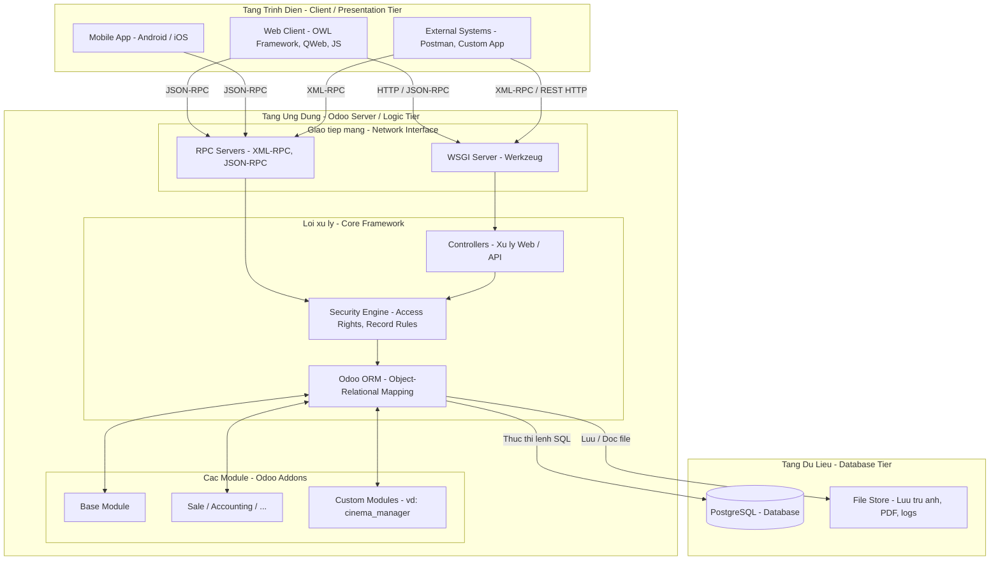

# Introduce Odoo Framwork V18

## 1. Tổng quan
Odoo là một bộ phần mềm quản trị doanh nghiệp (ERP) mã nguồn mở. Framework của Odoo được xây dựng dựa trên **kiến trúc module hóa (Modular Architecture)** kết hợp với mô hình đa tầng (Multi-tier), cho phép các nhà phát triển dễ dàng tùy biến, thêm mới hoặc tháo gỡ các tính năng (như Kế toán, Kho, Bán hàng) mà không làm ảnh hưởng đến lõi hệ thống.

### 1.1 Kiến trúc module hoá
Kiến trúc của Odoo cho phép tổ chức mã nguồn linh hoạt. Thông thường, các module tùy chỉnh được đặt trong một thư mục riêng biệt (như `custom_addons`) để tách biệt với mã nguồn gốc của Odoo.

```text
odoo-server/
├── odoo/                # Core Odoo (ORM, Web Server, v.v.)
├── addons/              # Các module tiêu chuẩn của Odoo (crm, sale, v.v.)
├── custom_addons/       # Nơi lưu trữ các module tùy chỉnh của dự án
│   ├── hrm_core/        # Quản trị nhân sự (Human Resource Management)
│   ├── prodid/          # Quản lý danh mục & thuộc tính sản phẩm (Product Identity)
│   └── account-financial-reporting/ # Hệ thống báo cáo tài chính mở rộng
└── odoo-bin             # Script khởi chạy hệ thống (Service Runner)
```

Việc tổ chức như trên giúp quản lý mã nguồn hiệu quả, đặc biệt trong các dự án có quy mô lớn. Các phân hệ trong `custom_addons` như **hrm_core**, **prodid**, và **account-financial-reporting** sẽ chứa toàn bộ logic nghiệp vụ, định nghĩa dữ liệu (Models) và giao diện (Views) đặc thù của doanh nghiệp.

### 1.2 Kiến trúc MVC

Odoo tuân theo kiến trúc đa tầng (multitier architecture), nghĩa là phần trình bày (giao diện), logic nghiệp vụ và nơi lưu trữ dữ liệu được tách biệt với nhau. Cụ thể hơn, hệ thống sử dụng kiến trúc ba tầng (three-tier architecture) (hình ảnh từ Wikipedia):


Một module Odoo chuẩn thường được tổ chức theo cấu trúc phân lớp rõ rệt để đảm bảo tính dễ đọc và bảo trì:

```text
custom_module/           # Thư mục gốc của Module
├── models/              # Lớp Dữ liệu (Models)
│   ├── __init__.py      # Import các file python nội bộ
│   └── hr_employee.py   # File định nghĩa logic và cấu trúc bảng
├── views/               # Lớp Hiển thị (Views)
│   ├── hr_views.xml     # Giao diện Form, Tree, Kanban
│   └── menu_items.xml   # Định nghĩa thanh menu điều hướng
├── security/            # Lớp Bảo mật (Security)
│   ├── ir.model.access.csv # Phân quyền xem/sửa/xóa cho các Group
│   └── hr_security.xml  # Quy tắc bảo mật mức bản ghi (Record Rules)
├── data/                # Cấu hình hệ thống (Data)
│   └── sequence_data.xml# Ví dụ: Cấu hình đánh số mã nhân viên tự động
├── static/              # Tài nguyên tĩnh (Frontend assets)
│   ├── description/     # Chứa Icon và ảnh mô tả hiển thị trong menu Apps
│   ├── src/             # Chứa code Javascript (OWL), SCSS, XML (QWeb)
│   └── img/             # Các hình ảnh sử dụng nội bộ trong module
├── wizard/              # Các Form tạm thời (Transient Models)
├── reports/             # Báo cáo in ấn (PDF/Excel)
├── controllers/         # Web/API Controllers
├── __init__.py          # File khởi tạo chính (Load models, wizards, v.v.)
└── __manifest__.py      # "Chứng minh thư" xác định thông tin & thứ tự nạp file
```

| Thư mục / Tệp | Mô tả chi tiết | Công nghệ |
| :--- | :--- | :--- |
| `models/` | **Logic Nghiệp vụ (Business Logic)**: Định nghĩa các model cơ sở dữ liệu và các hàm xử lý logic. Dùng để tạo bảng mới hoặc mở rộng các đối tượng có sẵn của Odoo. | Python |
| `views/` | **Giao diện Người dùng (UI)**: Định nghĩa các giao diện backend như Form, List (Tree), Kanban, Search và các Menu item. | XML |
| `security/` | **Phân quyền & Kiểm soát**: Định nghĩa quyền CRUD cho các nhóm người dùng (`ir.model.access.csv`) và Record Rules để bảo mật dữ liệu ở mức bản ghi. | CSV, XML |
| `data/` | **Dữ liệu Khởi tạo**: Cấu hình các chuỗi số (sequences), cron jobs (hành động tự động) và các dữ liệu mẫu cần thiết cho hoạt động của module. | XML |
| `reports/` | **Công cụ Báo cáo**: Chứa các template để xuất báo cáo PDF hoặc Excel thông qua engine QWeb của Odoo. | XML |
| `controllers/` | **Web Controllers**: Định nghĩa các API endpoint, định tuyến (routes) bên ngoài và các dịch vụ JSON-RPC / RESTful (đặc biệt cho tích hợp hệ thống). | Python |
| `__manifest__.py` | **Manifest của Module**: Chứa metadata của module như tên, phiên bản, thể loại, danh sách dependencies và thứ tự nạp các file dữ liệu. | Python |

**Nguyên tắc cần lưu ý:**
1.  **Thứ tự nạp file (Manifest):** Các file XML phải được liệt kê trong `__manifest__.py` theo đúng thứ tự logic (ví dụ nạp `data` trước `views`).
2.  **Quy chuẩn đặt tên:** Tên file nên mang tính gợi nhớ (ví dụ: `models/hr_job.py` đi kèm với `views/hr_job_views.xml`).
3.  **Tách biệt Logic:** Mọi xử lý liên quan đến database nên nằm trong `models/`, còn xử lý giao diện thuần túy hoặc hành động nút bấm nên nằm trong file XML hoặc phương thức gọi từ model.

---

### 1.3 Cách giao tiếp giữa các tầng


## 2. Ngăn xếp Công nghệ (Tech Stack) ở V18
Odoo V18 mang lại nhiều cải tiến về mặt hiệu năng nền tảng so với các phiên bản trước:
* **Cơ sở dữ liệu (Database Layer):** Sử dụng hệ quản trị CSDL quan hệ **PostgreSQL**. Phiên bản V18 tận dụng tốt hơn các tối ưu hóa của PostgreSQL 13+ (như truy vấn song song và hỗ trợ phân vùng bảng - Partitioned Table), giúp tăng tốc độ xử lý trên các cơ sở dữ liệu lớn.
* **Máy chủ (Backend Layer):** Lõi xử lý được viết bằng ngôn ngữ **Python**. Odoo 18 tối ưu hóa khả năng tương thích với Python 3.11+, giúp giảm lượng bộ nhớ tiêu thụ và tăng tốc độ thực thi mã.
* **Giao diện (Frontend/Client Layer):** Lớp giao diện web của Odoo hoạt động dưới dạng Single-Page Application (SPA). Ở V18, thành phần giao diện chủ yếu được xây dựng bằng **OWL (Odoo Web Library)** – một framework JavaScript theo hướng component-based do chính Odoo phát triển. Các bản cập nhật ở V18 hỗ trợ tốt hơn cú pháp ES6+ và tối ưu hóa việc đóng gói tài nguyên (asset bundling) để giảm băng thông tải trang.
* **Cache**: Odoo cung cấp một bộ công cụ (odoo.tools.cache) để lập trình viên chủ động cache kết quả trả về của các phương thức (methods) dựa trên tham số đầu vào. Cơ chế này áp dụng thuật toán LRU (Least Recently Used).

## 3. Các thành phần cốt lõi của Framework
* **ORM (Object-Relational Mapping):** Đây là "trái tim" của Odoo framework. Tầng ORM làm nhiệm vụ ánh xạ các lớp (Class) trong Python thành các bảng (Table) trong PostgreSQL. Thay vì viết SQL thuần, lập trình viên sử dụng các phương thức ORM (như `create`, `write`, `search`) để thao tác dữ liệu. Trong V18, ORM được cải tiến mạnh mẽ về cơ chế bộ nhớ đệm (ORM Cache decorators) để giảm thiểu các luồng gọi (overhead) xuống cơ sở dữ liệu.
* **Hệ thống View (XML):** Giao diện của Odoo (Form, List, Kanban, Pivot...) không được code cứng mà được định nghĩa thông qua các tệp XML. Framework sẽ đọc cấu trúc XML này và render ra HTML/JS tương ứng thông qua OWL.
* **API & Tích hợp:** Bên cạnh giao thức External API (XML-RPC/JSON-RPC) truyền thống, Odoo 18 mở rộng khả năng tích hợp linh hoạt hơn thông qua việc cải thiện hiệu suất REST API, mở rộng cơ chế Webhook và hỗ trợ các chuẩn xác thực hiện đại (OAuth2, Token-based authentication) giúp tăng cường bảo mật.
