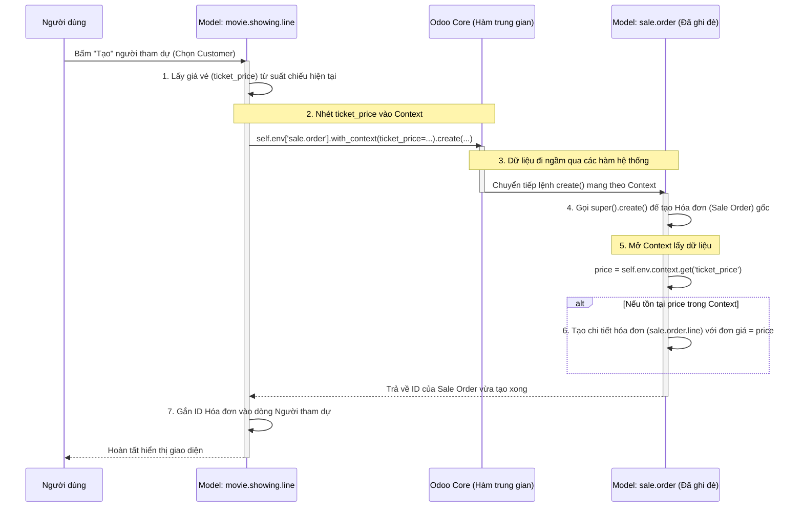

# Context Variable trong Odoo

## 1. Context là gì? (What is Context?)

- **Context** (`self.env.context`) là một **Python dictionary chỉ đọc (frozen dict)** được truyền ngầm theo mọi lời gọi hàm trong Odoo ORM.
- Nó hoạt động như một **"cái balo vô hình"**: bạn có thể nhét bất kỳ dữ liệu tùy chỉnh nào vào, và nó sẽ tự động đi xuyên qua hàng chục hàm trung gian mà không cần sửa đổi signature (tham số đầu vào) của những hàm đó.
- Context được thiết kế để truyền **metadata tạm thời** (không lưu database) giữa các lớp nghiệp vụ khác nhau trong cùng một request.

### 1.1 Context mặc định chứa gì?

Odoo tự động đưa một số giá trị vào context trước khi nó đến tay bạn:

| Key               | Ý nghĩa                                          | Ví dụ giá trị            |
| ----------------- | ------------------------------------------------- | ------------------------ |
| `lang`            | Ngôn ngữ hiện tại của người dùng                  | `'vi_VN'`, `'en_US'`    |
| `tz`              | Timezone (múi giờ) của người dùng                 | `'Asia/Ho_Chi_Minh'`    |
| `uid`             | ID của người dùng đang đăng nhập                  | `2`                      |
| `allowed_company_ids` | Danh sách ID công ty mà user được phép truy cập | `[1]`                   |
| `active_id`       | ID bản ghi đang mở trên giao diện                | `5`                      |
| `active_ids`      | Danh sách ID bản ghi đang được chọn              | `[5, 6, 7]`             |
| `active_model`    | Tên model đang hoạt động trên giao diện          | `'movie.showing'`       |

### 1.2 Tại sao cần Context?

- ORM Odoo **kiểm tra nghiêm ngặt** dictionary `vals` khi gọi `create()` / `write()`. Nếu bạn truyền key không phải là field thật của model → **lỗi ngay lập tức**.
- Context cho phép bạn **gửi dữ liệu tùy chỉnh** mà không vi phạm cấu trúc ORM, vì context tồn tại bên ngoài luồng validate dữ liệu.
- Giữa nơi gửi đi và nơi bắt lại có thể có **hàng chục hàm trung gian** của Odoo core. Context đi xuyên qua tất cả mà không bị chặn.

---

## 2. Sơ đồ luồng hoạt động (Sequence Diagram)



---

## 3. Các API thao tác với Context

### 3.1 Đọc Context hiện tại

```python
# Lấy toàn bộ context dictionary (frozen dict, chỉ đọc)
current_context = self.env.context

# Lấy một giá trị cụ thể (an toàn, trả về None nếu không có)
ticket_price = self.env.context.get('ticket_price')

# Lấy giá trị với default fallback
lang = self.env.context.get('lang', 'en_US')
```

### 3.2 Gửi Context đi — `with_context()`

Odoo cung cấp method `with_context()` trên mọi recordset để tạo **bản sao mới** của environment với context được cập nhật:

```python
# Cách 1: Truyền keyword arguments (KHUYẾN NGHỊ - gọn gàng nhất)
# Giữ nguyên context cũ, thêm/ghi đè key mới
self.env['sale.order'].with_context(
    ticket_price=record.ticket_price,
    movie_name=record.movie_name,
).create({...})

# Cách 2: Truyền dictionary (thay thế TOÀN BỘ context cũ)
# ⚠️ CẨN THẬN: Mất hết context mặc định (lang, tz, uid...)
self.env['sale.order'].with_context({
    'ticket_price': 120000,
}).create({...})

# Cách 3: Copy context cũ rồi update (dài dòng, ít dùng)
ctx = self.env.context.copy()
ctx.update({'ticket_price': 120000})
self.env['sale.order'].with_context(ctx).create({...})
```

> **Lưu ý quan trọng:** Cách 1 (keyword args) là cách an toàn nhất vì nó **merge** vào context cũ. Cách 2 (dict) sẽ **thay thế hoàn toàn** context, làm mất `lang`, `tz`, `uid`... có thể gây lỗi tiềm ẩn.

### 3.3 Bắt lại Context — `self.env.context.get()`

Ở bất kỳ hàm nào trong chuỗi gọi (thường là hàm override), bạn "mở balo" bằng:

```python
@api.model_create_multi
def create(self, vals_list):
    orders = super().create(vals_list)
    
    # Mở balo lấy dữ liệu
    ticket_price = self.env.context.get('ticket_price')
    
    if ticket_price:
        # Xử lý logic khi context có chứa dữ liệu
        ...
    
    return orders
```

---

## 4. Ứng dụng thực tế: Tự động tạo Hóa đơn khi bán vé phim

### 4.1 Phân tích bài toán

- **Mục tiêu:** Khi tạo một "Người tham dự" (`movie.showing.line`) cho một suất chiếu, hệ thống tự động tạo một Hóa đơn (`sale.order`) và ghi nhận luôn giá vé vào hóa đơn đó.
- **Vấn đề:** Hàm `create()` gốc của `sale.order` chỉ nhận các field schema chuẩn. Không có field nào tên `ticket_price`. Nếu truyền trực tiếp → báo lỗi.
- **Giải pháp:** Dùng Context để "buôn lậu" `ticket_price` qua hệ thống ORM, rồi bắt lại ở hàm `create()` đã override của `sale.order`.

### 4.2 Phía Gửi — `movie_showing_line.py`

```python
# File: models/movie_showing_line.py
from odoo import models, fields, api, _
from odoo.exceptions import ValidationError


class MovieShowingLine(models.Model):
    _name = 'movie.showing.line'
    _description = 'Movie Showing Line (Ticket)'

    showing_id = fields.Many2one('movie.showing', string='Showing', required=True)
    customer_id = fields.Many2one('res.partner', string='Customer', required=True)
    ticket_price = fields.Integer(related='showing_id.price', string='Ticket Price', store=True)
    movie_name = fields.Char(related='showing_id.movie_id.name', string='Movie', store=True)
    sale_order_id = fields.Many2one('sale.order', string='Sale Order', readonly=True)
    state = fields.Selection([
        ('draft', 'Draft'),
        ('confirmed', 'Confirmed'),
        ('cancelled', 'Cancelled'),
    ], default='draft', string='Status')

    def action_confirm_ticket(self):
        """Confirm ticket and create Sale Order with ticket_price in context."""
        for record in self:
            if record.state != 'draft':
                raise ValidationError(_('Only draft tickets can be confirmed.'))

            # ========== BƯỚC QUAN TRỌNG ==========
            # Gói ticket_price vào Context ("balo") rồi gọi create()
            sale_order = self.env['sale.order'].with_context(
                ticket_price=record.ticket_price,  # Nhét giá vé vào balo
                movie_name=record.movie_name,       # Nhét tên phim vào balo
            ).create({
                'partner_id': record.customer_id.id,
                # Chỉ truyền field THẬT của sale.order, KHÔNG truyền ticket_price ở đây
            })
            # ======================================

            record.write({
                'sale_order_id': sale_order.id,
                'state': 'confirmed',
            })
```

### 4.3 Phía Bắt — `sale_order.py`

```python
# File: models/sale_order.py
from odoo import models, fields, api


class SaleOrder(models.Model):
    _inherit = 'sale.order'

    @api.model_create_multi
    def create(self, vals_list):
        # Bước 1: Chạy logic gốc trước (tạo Sale Order bình thường)
        orders = super().create(vals_list)

        # Bước 2: "Mở balo" — đọc dữ liệu tuỳ chỉnh từ context
        ticket_price = self.env.context.get('ticket_price')
        movie_name = self.env.context.get('movie_name', 'Movie Ticket')

        # Bước 3: Nếu context có ticket_price → tạo thêm Sale Order Line
        if ticket_price:
            for order in orders:
                self.env['sale.order.line'].create({
                    'order_id': order.id,
                    'name': f'Movie Ticket: {movie_name}',
                    'product_uom_qty': 1,
                    'price_unit': ticket_price,
                })

        return orders
```

---

## 5. Các trường hợp sử dụng phổ biến khác

| Trường hợp                      | Context Key            | Mô tả                                                        |
| ------------------------------- | ---------------------- | ------------------------------------------------------------- |
| Đặt giá trị mặc định từ view   | `default_<field_name>` | Odoo tự động đọc `context.get('default_field')` khi tạo mới  |
| Bỏ qua kiểm tra quyền          | `tracking_disable`     | Tắt tính năng tracking khi import hàng loạt cho nhanh         |
| Thay đổi ngôn ngữ hiển thị     | `lang`                 | `self.with_context(lang='vi_VN').name` → trả tên tiếng Việt   |
| Truyền context từ XML view      | `context="{...}"`      | Đặt ngay trong thẻ `<field>` hoặc `<button>` trên giao diện  |

### 5.1 Ví dụ: Default value từ XML View

```xml
<!-- Khi nhấn nút "Add Line" trong form Showing, customer mặc định  -->
<field name="ticket_line_ids" context="{'default_showing_id': active_id}"/>
```

### 5.2 Ví dụ: Truyền context từ Button trong XML

```xml
<button name="action_confirm_ticket"
        string="Confirm"
        type="object"
        context="{'force_company': 1}"/>
```

---

## 6. Các lưu ý quan trọng (Best Practices & Pitfalls)

### ✅ NÊN:

1. **Luôn dùng `self.env.context.get('key')`** thay vì `self.env.context['key']` để tránh `KeyError` nếu context không chứa key đó.
2. **Dùng keyword arguments** trong `with_context(key=value)` (Cách 1) để giữ nguyên context mặc định.
3. **Đặt tên key rõ ràng** và có prefix module để tránh trùng với context key của module khác. VD: `cinema_ticket_price` thay vì `price`.
4. **Kiểm tra tồn tại trước khi dùng**: Luôn bọc logic xử lý trong `if context_value:` để code hoạt động bình thường khi không có context đặc biệt.

### ❌ KHÔNG NÊN:

1. **Không truyền dict thay thế toàn bộ context** (`with_context({...})`) → mất `lang`, `tz`, `uid` gây lỗi âm thầm.
2. **Không lạm dụng context để thay thế field thật** → Context chỉ dùng cho dữ liệu tạm thời, KHÔNG lưu vào database. Nếu cần lưu trữ, hãy tạo field.
3. **Không ghi đè lên key hệ thống** (`lang`, `tz`, `uid`, `active_id`...) trừ khi bạn biết rõ hậu quả.
4. **Không dùng context cho logic phức tạp đa bước** → Nếu cần truyền nhiều dữ liệu qua nhiều model liên tiếp, hãy cân nhắc dùng transient model (wizard) thay vì nhồi nhét tất cả vào context.

### ⚠️ Lỗi thường gặp:

```python
# ❌ SAI: Truyền ticket_price trực tiếp vào vals → Odoo báo lỗi field không tồn tại
self.env['sale.order'].create({
    'partner_id': customer.id,
    'ticket_price': 120000,  # ValueError: field 'ticket_price' does not exist
})

# ✅ ĐÚNG: Truyền qua context, chỉ giữ field thật trong vals
self.env['sale.order'].with_context(ticket_price=120000).create({
    'partner_id': customer.id,
})
```

---

## 7. Tóm tắt cơ chế 3 bước

| Bước | Hành động              | Code API                                           |
| ---- | ---------------------- | -------------------------------------------------- |
| 1    | **Đóng gói** dữ liệu  | `.with_context(key=value)`                         |
| 2    | **Đi ngầm** qua ORM   | _(Tự động, không cần code)_                        |
| 3    | **Mở gói** và xử lý   | `self.env.context.get('key')`                      |

> **Tổng kết:** Context là cơ chế "truyền dữ liệu ngầm" mạnh mẽ nhất trong Odoo. Nó cho phép bạn gửi thông tin tùy chỉnh đi xuyên qua hệ thống ORM mà không cần sửa đổi bất kỳ hàm nào trong chuỗi gọi trung gian. Hiểu đúng và dùng đúng context là kỹ năng cốt lõi để phát triển module Odoo chuyên nghiệp.